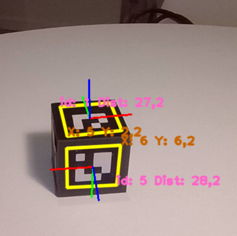

# Computer-Vision
My contributions regarding Computer Vision in the organitation [github.com/AEA-ComputerVisionRoboticArm](https://github.com/AEA-ComputerVisionRoboticArm). 

    

The goal of the project was to implement a **look and move vision control architecture** on the Arduino arm, namely a position controlled robot in which a vision device (camera) is used to detect an object in the 
robot’s scene, whose position (and orientation) is then used for online path planning in order to drive the robot to the identified object, which in our case was a 3D printed cube (the orange one in the image above). This GitHub repository aims to showcase the educational and exploratory journey undertaken over almost a year of research, to identify the best **pose estimation** solution applicable to the arm using only a monocular camera. This task is one of the main challenges in modern computer vision.

After testing and studying various Deep Learning techniques, from basic FF-NNs to more complex CNNs, including well-known and widely-used architectures like YOLO, we decided to use **Aruco Markers** to successfully accomplish the task in a simple and flexible way. Each Aruco Marker consists of a 16-bit matrix that represents its identifier, enclosed in a black border that facilitates its detection. The main benefit of these markers is that a single marker provides enough correspondences (its four corners) to obtain the camera pose. 

  
  

We printed 6 different markers, which were then attached to each face of the cube to ensure real-time estimation of both the pose (a set of 3 axes aligned on the cube’s face) and the distance and position of the front face relative to the camera system:

## Pose Estimation
- **Detection**: The Aruco Marker is detected in an image using computer vision techniques. The black border helps differentiate it from the background.
- **Corner Extraction**: Once detected, the corners of the marker (usually four) are identified.
- **Homography Calculation**: Based on the known size of the marker and its corners in the image, a homography (transformation matrix) is computed, relating the 2D points in the image to the 3D points in the real world.
- **Pose Estimation**: Using the homography and camera calibration parameters (intrinsics), the marker's 3D position and orientation (pose) relative to the camera are estimated, including roll, pitch, and yaw.

## Distance Estimation 
- **Marker Size**: The actual physical size of the marker is known in advance.
- **Pixel Size**: From the image, the size of the marker in pixels is measured.
- **Distance Calculation**: By comparing the marker's real-world size to its size in the image, and using camera calibration data, the distance from the camera to the marker can be calculated using basic geometry or camera projection formulas.

